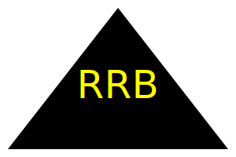

# SVG Logo Maker: Module 10 Challenge

## Description

This project provides a simple and efficient CLI app to create an SVG logo by answering a few simple prompts. Using the `inquirer` library, the user is prompted to define 4 aspects of their logo: text (up to 3 characters in length), text color, shape, and shape color. A `logo.svg` file is then written with the corresponding user choices.  

Building this app helped to expand my knowledge on class constructors and inheritance, and further helped expand my knowledge on the file system (`fs`) library and writing new files, as well as using inquirer. In addition, this was our first project implementing testing (see Tests section below).  

This project is easily expandable, as well. Though we've started with a very simple logo, it would be easy to add additional shapes and their constructor classes. You could also make the text (including size and color) more customizeable in future iterations of this app.

## Table of Contents 

- [User Story](#user-story)
- [Acceptance Criteria](#acceptance-criteria)
- [Installation](#installation)
- [Usage](#usage)
- [Features](#features)
- [Tests](#tests)

## User Story
AS a freelance web developer  
I WANT to generate a simple logo for my projects  
SO THAT I don't have to pay a graphic designer  

## Acceptance Criteria
GIVEN a command-line application that accepts user input  
WHEN I am prompted for text  
THEN I can enter up to three characters  
WHEN I am prompted for the text color  
THEN I can enter a color keyword (OR a hexadecimal number)  
WHEN I am prompted for a shape  
THEN I am presented with a list of shapes to choose from: circle, triangle, and square  
WHEN I am prompted for the shape's color  
THEN I can enter a color keyword (OR a hexadecimal number)  
WHEN I have entered input for all the prompts  
THEN an SVG file is created named `logo.svg`  
AND the output text "Generated logo.svg" is printed in the command line  
WHEN I open the `logo.svg` file in a browser  
THEN I am shown a 300x200 pixel image that matches the criteria I entered

## Installation

To install this app, you can clone the code here: //github repo url  

You will need to have `node.js` installed on your computer to run this app.  

Once on your local machine, you will need to install `inquirer v. 8.2.4` to run the user prompts in the CLI. In order to use the testing suites and run the unit tests, you will need to install `jest` as a dev dependency, as well. See Tests below for more information on testing, and see the package.json to see all dependencies for the app. Run `npm install` in your CLI to install all corresponding libraries.

## Usage

Follow the instructions below to use this app to easily create a simple SVG logo.  

- Follow Installation instuctions to clone and install all necessary libraries for this app  
- In your command line, run `node index.js`   
- Answer the following prompts, choosing a shape from the list when prompted with that question  
- Once `logo.svg` is succesfully created, you can view your new logo in a browser  
- Rename your logo.svg file to save, and re-run the CLI to continue to create new logos  

** walk-thru video and screenshots, example svgs

Walk-through Tutorial Vid (link to Google Drive): https://drive.google.com/file/d/1qakh_NwkYhJPQOdDTK3NbeVO2XYW8K0Z/view  

  
  
  
  
  

## Features

Features in this project include:  
- Use of Inquirer prompts to gather 4 user inputs to create an SVG file  
- Use of fs library to write a new file (in this case, an .svg file)  
- Use of class constructors to create blueprints for each of the shapes  
- Use of inheritance to re-use the setColor() function in the parent constructor, Shape  
- Use of Jest to run tests on the setColor() and render() functions in the constructors

## Tests

Testing is ran with `Jest` on this app. You will need to install jest as a dev dependency if you'd like to run the testing suites created in `shapes.test.js`, in the `__test__` folder.  

Once installed, in order to run the tests, you'll run `npm run test` in your CLI.

The unit tests are designed to test two things:
- The functionality of the setColor() function in the Shape class constructor, which is then inherited by the Triangle, Circle, and Square class constructors. This function takes the user inputted shape color choice, and applies it to the SVG string rendered in the individual shape constructors.  
- The functionality of the render() functions in each of the Tri/Cir/Squ constructors. This function renders an SVG string with shape-appropriate coordinates and width/height data, as well as the color set by the inherited setColor() function.  

Overall, the tests will check if these constructor functions produce the correct SVG string, with the correct shape and color chosen by the user.